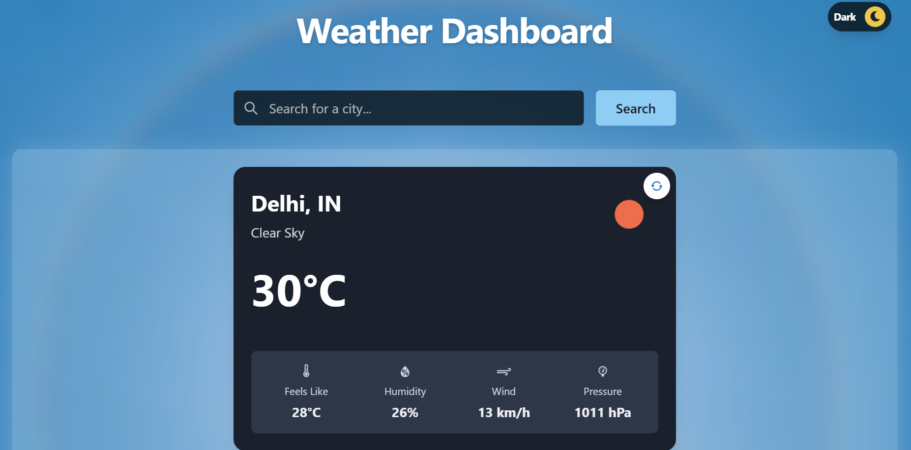

# Weather Dashboard

A modern, responsive weather dashboard application built with React and Chakra UI. View live weather conditions and forecasts with beautiful dynamic backgrounds that change based on weather conditions and time of day.

🌐 **Live Demo**: [Weather Dashboard](https://weather-dashboard-kiit.vercel.app)



## Features

### Core Functionality
- Real-time weather data from OpenWeatherMap API
- Current weather conditions display
- 5-day weather forecast
- Search for any city worldwide
- Search history with quick access to previous searches
- Auto-refresh capability
- Metric units (Celsius)

### Visual Features
- Dynamic backgrounds that change based on:
  - Weather conditions (Clear, Cloudy, Rain, Snow, Thunderstorm, Mist)
  - Time of day (Day/Night)
- Smooth transitions between weather states
- Responsive design for all screen sizes
- Beautiful blur effects and overlays
- Modern, clean UI with Chakra UI components

### Technical Features
- Optimized image loading with preloading for common weather states
- Responsive image sizing and compression
- Smooth state transitions
- Accessibility features
- Respect for user's motion preferences
- Error handling and loading states

## Technology Stack

- **Frontend Framework**: React + Vite
- **UI Library**: Chakra UI
- **API**: OpenWeatherMap
- **Hosting**: Vercel
- **State Management**: React Hooks
- **Styling**: Chakra UI + Custom CSS

## Setup and Installation

1. Clone the repository:
   ```bash
   git clone https://github.com/your-username/weather-dashboard.git
   cd weather-dashboard
   ```

2. Install dependencies:
   ```bash
   npm install
   ```

3. Create a `.env` file in the root directory:
   ```env
   VITE_OPENWEATHER_API_KEY=your_api_key_here
   ```

4. Get your API key:
   - Sign up at [OpenWeatherMap](https://openweathermap.org/)
   - Generate an API key from your account
   - Replace `your_api_key_here` in the `.env` file with your actual API key

5. Start the development server:
   ```bash
   npm run dev
   ```

## Deployment

This project is deployed and live on Vercel! You can view it at [https://weather-dashboard-kiit.vercel.app](https://weather-dashboard-kiit.vercel.app)

To deploy your own instance:

1. Fork this repository
2. Sign up on [Vercel](https://vercel.com)
3. Import your forked repository
4. Select "Vite" as your framework preset when prompted
5. Add your OpenWeatherMap API key to the environment variables:
   - Name: `VITE_OPENWEATHER_API_KEY`
   - Value: Your OpenWeatherMap API key
6. Deploy!

> ⚠️ **Security Note**: Never commit your `.env` file or expose your API keys in your repository. Always use environment variables in your deployment platform.

The Vite framework preset ensures that:
- Build commands are correctly configured
- Output directory is properly set
- Environment variables are handled correctly
- Hot module replacement works in development

## Environment Variables

Required environment variables:
- `VITE_OPENWEATHER_API_KEY`: Your OpenWeatherMap API key

## Contributing

Contributions are welcome! Please feel free to submit a Pull Request.

## License

This project is licensed under the MIT License - see the [LICENSE](LICENSE) file for details.

## Acknowledgments

- Weather data provided by [OpenWeatherMap](https://openweathermap.org/)
- Background images from [Unsplash](https://unsplash.com/)
- UI components from [Chakra UI](https://chakra-ui.com/)

## API Integration

This project uses the OpenWeatherMap API:
- Current Weather API: https://api.openweathermap.org/data/2.5/weather
- 5-Day Forecast API: https://api.openweathermap.org/data/2.5/forecast
- Rate Limit: 60 calls/minute for free tier
- Units: Metric (Celsius)


## Troubleshooting

- **API Key Issues**: If you see an error about the API key, make sure you've correctly added it to the `.env` file.
- **City Not Found**: Check the spelling of the city name or try a more specific location (e.g., "London, UK" instead of just "London").
- **Rate Limiting**: The free tier of OpenWeatherMap API has a limit of 60 calls per minute. If you exceed this, you'll need to wait before making more requests.

